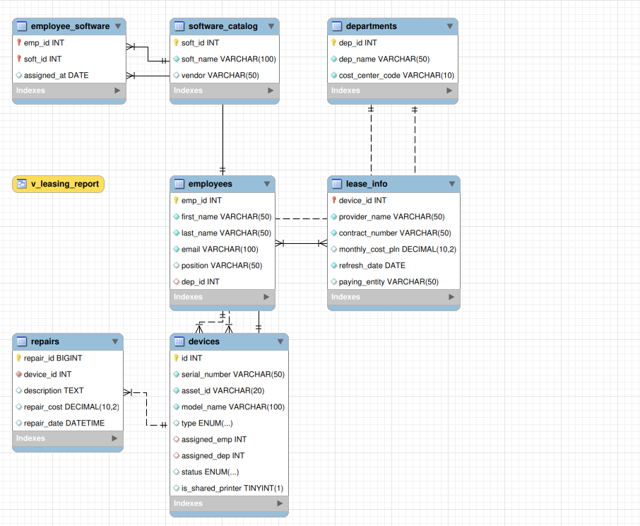

#  Corporate IT Asset & Identity Management System

## Project Overview
This project involves the design and implementation of a **relational database system** for managing IT assets, software licenses, and employee lifecycles in a corporate environment.The goal was to replace error-prone manual tracking (Excel) with a structured, ACID-compliant SQL solution.

The system not only stores data but actively enforces **business logic** through stored procedures, simulating real-world **IAM (Identity and Access Management)** workflows like automated onboarding and secure offboarding of employees.

##  Cybersecurity & Integrity Perspective
As an aspiring Security Engineer, I designed this database with **Data Integrity (CIA Triad)** and **Auditability** in mind:

* **Identity Lifecycle Management:** Implemented stored procedures (`OnboardNewEmployee`, `OffboardEmployee`) to automate the provisioning and de-provisioning of assets. [cite_start]This reduces human error and ensures that terminated employees instantly lose association with company assets.
**Data Integrity & Constraints:** Used foreign keys with `ON DELETE SET NULL/CASCADE` rules to prevent "orphaned records" and ensure that sensitive asset data is always linked to a valid owner or department.
**Normalization (3NF):** The database follows strict 3rd Normal Form standards to eliminate redundancy and data anomalies, ensuring a "Single Source of Truth".
**Engine Hardening:** Forced usage of `InnoDB` engine to ensure transaction reliability and row-level locking.

##  Tech Stack
* **Database:** MySQL
* **Language:** SQL (DDL, DML, Stored Procedures, Triggers)
* **Design Tool:** ERD (Entity Relationship Diagram)
* **Key Concepts:** Normalization (1NF-3NF), ACID, Relational Integrity.

##  Database Schema (ERD)
The system is built on 7 interconnected tables, separating logic for Departments, Employees, Devices, and Software Licenses.

*(Entity Relationship Diagram showing 1:1, 1:M, and M:M relationships)*

##  Key Features & Code Snippets

### 1. Automated Onboarding (IAM Simulation)
A stored procedure that automatically creates an employee profile and assigns an available laptop from the "In Stock" pool, ensuring immediate operational readiness.

2. Secure Offboarding (Revoking Access)
Security-critical procedure. When an employee is terminated, the system automatically reclaims their assets back to the warehouse inventory, preventing equipment loss.

3. Financial Reporting View
A dynamic view v_leasing_report allows the IT/Finance department to audit monthly costs per cost center.

🚀 How to Run
1.Clone the repository.

2. Import corporate_assets.sql into your MySQL server.

3. Run the test procedures located at the bottom of the SQL file to simulate employee hiring/firing.
